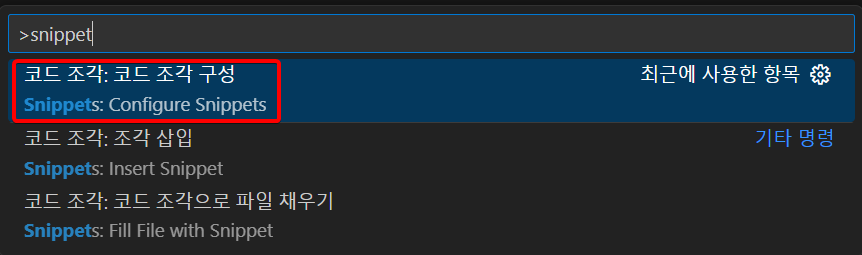
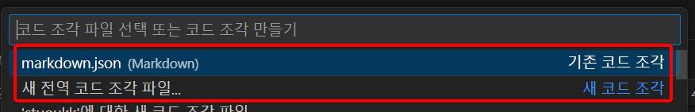
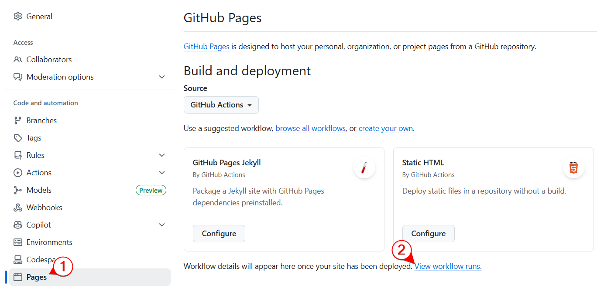
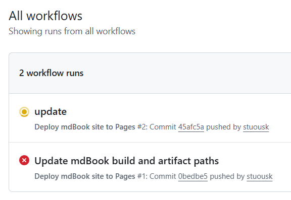
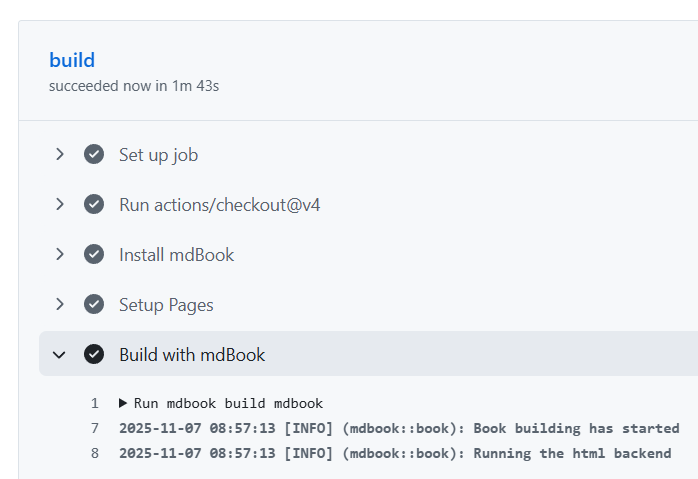
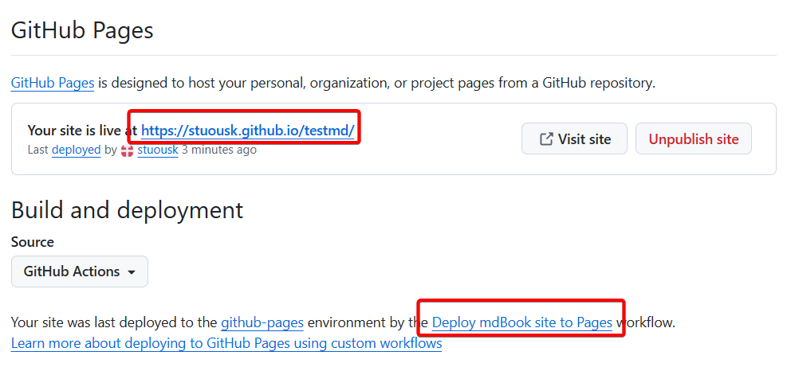
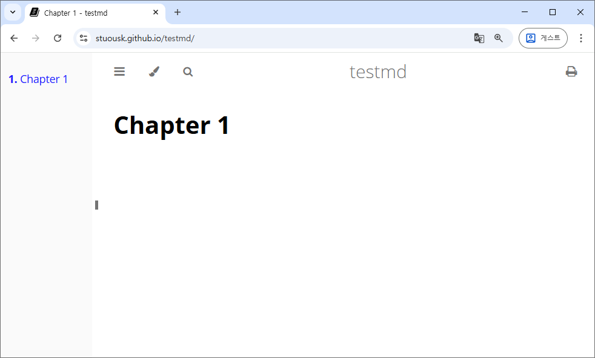

# 2025-11-07 (금)

이걸 왜 이제 하고 있을까. 

매일 공부하거나 연구하는 걸 제대로 남겨보려 한다. TIL말고, 매일 뭘 공부했는지를 전부터 적었으면 훨씬 좋았을텐데.


## github actions에서 mdbook 사용하기

mdbook으로 구성한 글을 github actions에 자동으로 build하게 하는 방법이다.

### 1. rust 설치


### 2. github 작업 1

1. 레포지토리 만든다. 여기서의 이름은 testmd. 다른 옵션은 건드리지 않는다. public으로 만든다.

2. settings / pages에서 build and deployment의 값을 "github actions"로 바꾼다. 

3. browse all workflows를 눌러 workflow를 선택한다. pages 섹션의 mdBook을 찾아 그 아래 "Configure"를 누른다. 

4. testmd / .github / workflows / mdbook.yml 파일을 수정하는 화면이 나타날거다.

5. 여기서 우리의 상황에 맞게 몇 곳을 수정하자.<br>  
이 아래에서 mdbook 프로젝트를 생성할 건데, 그 mdbook 프로젝트는 이 testmd 프로젝트 내에 생성된다. 그러니까, `testmd/mdbook` 폴더가 mdbook 프로젝트 폴더가 된다.<br>   
여기서 중요한 건. testmd 폴더가 아닌 그 하위 폴더인 mdbook 폴더가 mdbook용 프로젝트 폴더가 된다는 거다. 그래서 book.toml 파일의 위치가 testmd/mdbook/book.toml 라는 거다.<br>   
이에 맞게 mdbook.yml 파일을 수정해야 한다. 

6. testmd / .github / workflows / mdbook.yml 파일 수정 1
    ```yaml
      - name: Build with mdBook
        run: mdbook build mdbook
    ```
    그냥 `run: mdbook build` 라고 되어 있을텐데, 이건 `testmd\src\` 폴더에 우리의 mardown 파일들이 들어있는 경우라서, 지금의 경우처럼 `testmd\mdbook\src\` 폴더에 markdown 소스 파일들이 들어있다는 걸 명확히 하기 위해 mdbook 프로젝트 폴더의 이름인 `mdbook`을 명시해준다. 

7. testmd / .github / workflows / mdbook.yml 파일 수정 2
    ```yaml
      - name: Upload artifact
        uses: actions/upload-pages-artifact@v3
        with:
          path: ./mdbook/book
    ```
    그냥 `path: ./book` 라고 되어 있을텐데, 같은 이유로 `mdbook` 폴더를 명시해준다.

8. [Commit changes...] 버튼을 눌러준다.


### 3. mdbook 설치, 프로젝트 생성

1. github에서 testmd 프로젝트를 clone 한다.<br>   
`d:\testmd`: git에서 clone한 폴더

2. mdbook 설치, 프로젝트 생성(프로젝트명: mdbook)
    ```
    d:\testmd> cargo install mdbook

    d:\testmd> mdbook init mdbook
    d:\testmd> cd mdbook
    d:\testmd\mdbook> mdbook serve --open
    ```

### 4. SUMMARY.md에 편하게 날짜 입력하기 

일기 형식으로 쓰려면 SUMMARY.md에 날짜 형식으로 파일을 생성해야 하는데, vscode의 snippets를 이용해 쉽게 하는 방법

1. ctrl + shift + P를 누른 다음, snippet로 검색한다. 


2. 기존에 만들어 놓은 markdown.json 파일이 있으면 그걸 사용하고, 없으면 아마 아래 '새 전역 코드 조각 파일...' 메뉴만 나올 거 같다. 


3. markdown.json 파일에 아래 내용을 추가한다.
    ```json
    "insert new diary": 
    {
      "prefix": ["d", "D", "ㅇ"],
      "body": [ "- [${CURRENT_YEAR}-${CURRENT_MONTH}-${CURRENT_DATE} (${CURRENT_DAY_NAME_SHORT})](./${CURRENT_YEAR}/${CURRENT_YEAR}-${CURRENT_MONTH}-${CURRENT_DATE}.md)"	],
      "description": "오늘 날짜 입력"
    } 
    ```

    이제 d 키를 누르고 ctrl + i 를 하면 아래와 같은 형식으로 SUMMARY.md 파일에 오늘 날짜를 쉽게 추가할 수 있다.

    ```
    - [2025-11-07 (금)](./2025/2025-11-07.md)
    ```

    요일이 (금) 이라고 한글로 되어 있는데, 이거 vscode를 한글로 바꿔야 한다. 안 그럼 FRI 가 찍힌다. 이거 때문에 vscode 한글로 바꿨다. 오늘 바꿨더니 아직 한글 적응이 안되네.


### 5. `mdbook/src` 폴더에 md 파일 추가하는 등 내용 변경하고 push 하기

아까 mdbook.yml 을 만들고 수정한 것 때문에 push하면 자동으로 github actions에 의해 mdbook build가 실행되어 github pages에 자동으로 deploy된다. local에서 build 하지 않아도 된다.



위와 같이 "view workflow runs" 링크를 누르면 



이런 화면이 나오고, 



진행상황을 볼 수 있다.


### 6. deploy가 끝나면 주소가 나온다.



deploy에 성공하면 주소가 나온다.

